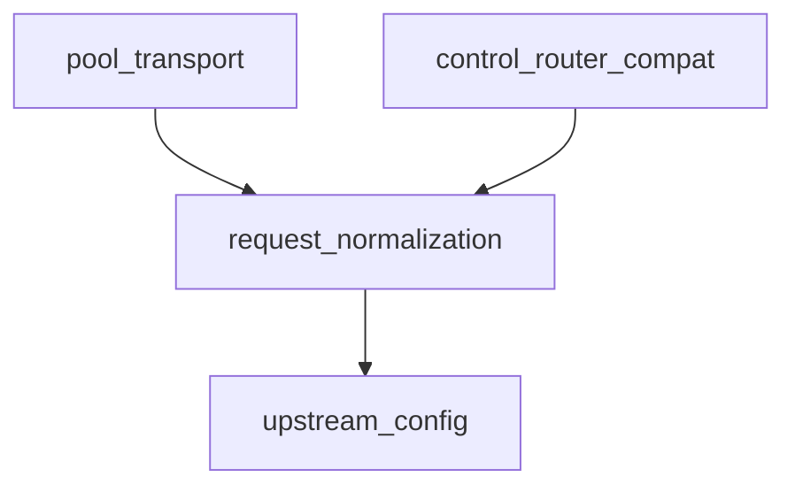

# Pipeline Plan

## Trigger
- Proposal: docs/versions/v0.6/modules/gateway-runtime/001-http-upstreams-merge/proposal.md
- User launch confirmed: yes
- User launch statement: 批准，自动处理后续步骤
- Per-stage user confirmation: skipped by explicit user auto-pipeline authorization
- Auto-confirm completed document stages: no design/testing Markdown documents generated; repository-local document extensions only
- Auto-pipeline document policy: no design/testing markdown docs; testplan.yaml required
- Version: v0.6
- Packet module: gateway-runtime
- Task name: 001-http-upstreams-merge
- Target module(s): gateway-runtime
- change_id values: P-http-upstreams-1

## Acceptance Baseline
- Final acceptance is judged against:
  - `proposal.md`

## Stage Graph
| Task ID | Stage | Responsibility | Scope | Parent Task | Depends On | Output | Done Condition |
|---------|-------|----------------|-------|-------------|------------|--------|----------------|
| D-1 | design | Convert the confirmed merge requirement into dependency, interface, state, failure, and file-scope mappings. | task-local pipeline plan | root | none | validated design mappings and implementation bindings | plan and state pass pipeline validation |
| I-1 | implementation | Orchestrate the admitted semantic conflict resolution. | admitted gateway-runtime production paths | root | D-1 | conflict-free implementation and admission evidence | all file tasks complete and implementation scope passes |
| T-1 | testing | Register and execute post-implementation unit, integration, and compile-closure checks. | task testplan, test fixtures, runner evidence, and state coverage | root | I-1, I-cargo, I-forward, I-config, I-host-marker, I-http-server, I-router | task-local test artifact | testing coverage and task-local all run pass |
| A-1 | acceptance | Audit proposal, plan, code, tests, and task evidence. | task-local acceptance report and state | root | T-1 | acceptance-report.md | report checker passes with accepted conclusion |

## Submodule Tasks
| Task ID | Stage | Responsibility | Submodule | Parent Task | Depends On | Output | Done Condition |
|---------|-------|----------------|-----------|-------------|------------|--------|----------------|
| I-cargo | implementation | Resolve HTTP pool dependency lines without downgrading current I/O. | cyfs-gateway-lib dependency surface | I-1 | D-1 | `Cargo.toml` | selected versions compile |
| I-forward | implementation | Accept named upstream tokens in the forward command. | forward parser | I-1 | I-cargo | `cmds/forward.rs` | named token reaches runtime resolution |
| I-config | implementation | Normalize trusted-certificate path configuration. | server configuration assembly | I-1 | I-forward | `server/mod.rs` | relative path is normalized before deserialization |
| I-host-marker | implementation | Record explicit process-chain Host mutation policy. | request map execution | I-1 | I-config | `server/server.rs` | explicit Host policy is distinguishable from default proxy behavior |
| I-http-server | implementation | Integrate named pools, connectors, normalization, timeouts, error mapping, and lease lifecycle. | HTTP server runtime | I-1 | I-host-marker | `server/http_server.rs` | direct and pooled behavior sets are preserved |
| I-router | implementation | Preserve inbound Host for generated dynamic HTTP routes. | control-plane router rule generation | I-1 | I-http-server | `gateway.rs` | existing virtual-host gateway integration returns success |

## Parallel Scheduling
- Strategy: dependency-ready-set
- Concurrency: use all runtime-available child-agent slots
- Shared artifact owner: parent-orchestrator
- Lock directory: `.harness/locks/`
- Dispatch rule: launch the maximum dependency-ready set with disjoint exclusive write scopes before waiting; immediately backfill free slots
- Serialization reasons: explicit dependency, overlapping write scope, or exhausted concurrency capacity only
- Evidence: record launched task ids and serialization reasons in sibling `pipeline/state.json` scheduler waves

## Dependency Graphs

| Level | Parent | Node | Depends On |
|-------|--------|------|------------|
| submodule | gateway-runtime | upstream_config | none |
| submodule | gateway-runtime | request_normalization | upstream_config |
| submodule | gateway-runtime | pool_transport | request_normalization |
| submodule | gateway-runtime | control_router_compat | request_normalization |

## Exported Interfaces
| Interface | Owner | Consumer | Compatibility | Affected Callers | Migration Path |
|-----------|-------|----------|---------------|------------------|----------------|
| `http.upstreams` configuration | upstream_config | `ProcessChainHttpServerBuilder` | backward-compatible | Existing configs omit the optional field. | No migration required; defaults preserve direct forwarding. |
| named token accepted by `forward` | upstream_config | process-chain rule execution | backward-compatible | Existing absolute URL rules remain valid. | Use a configured name only when pooling is desired. |
| proxy Host and URI normalization | request_normalization | direct and pooled send paths | backward-compatible | Existing explicit Host mutations and generated routers. | Explicit Host policy wins; generated routers self-assign inbound Host. |
| fixed HTTP/1 pool connector | pool_transport | named upstream runtime | new | Named upstream execution only. | No caller migration; constructed internally by the builder. |

## API and Build Surface Impact
- Public API impact: backward-compatible
- Crate-root export change: no
- Build-surface change: yes
- Documentation examples affected: no

## Consumer Migration Closure
| Old Symbol | New Path | change_id | Consumer Path | Consumer Kind | Migration Status |
|------------|----------|-----------|---------------|---------------|------------------|
| no removed symbol | `sfo-http-pool 0.1.1` dependency | P-http-upstreams-1 | `src/components/cyfs-gateway-lib/Cargo.toml` | build manifest | migrated |

## State Ownership
| State | Owner | Access Interface | Lifecycle | Failure Transitions |
|-------|-------|------------------|-----------|---------------------|
| validated named upstream map and fixed clients | `ProcessChainHttpServer` | configured-name lookup during forward resolution | build once, share immutably, drop with server reload/shutdown | invalid config rejects startup; server replacement drops old pool owners |
| live/idle connection lease | `sfo_http_pool::fixed::Client` | acquired send stream and response body | acquire, send, hold through EOS, return idle or evict | connector/send/body error or early drop evicts instead of reusing |
| explicit Host override marker | request process-chain execution | request extension read by outbound normalization | absent by default, set on explicit Host mutation, consumed as policy signal | marker absence selects upstream-authority default; explicit removal remains authoritative |

## Failure Flows
| Flow | Boundary | Failure | Handling |
|------|----------|---------|----------|
| pool acquisition before request commitment | gateway to fixed client connector | DNS, TCP, TLS, tunnel, or HTTP handshake failure | preserve original body, classify canonical reason, and allow existing next-upstream policy where eligible |
| request send and response lifecycle | acquired stream to upstream | send failure, header timeout, body idle timeout, cancellation, or early drop | do not silently replay committed body; retain existing timeout/error mapping and evict affected lease |
| dynamic router forwarding | control-plane generated rule to proxy Host default | upstream authority replaces inbound virtual Host | generated HTTP rule explicitly self-assigns `REQ.host` before `forward` |

## Rejected Alternatives
| Decision Type | Selected | Rejected | Reason |
|---------------|----------|----------|--------|
| boundary | Keep RTCP behind existing `TunnelManager`. | Merge incoming RTCP protocol/cache edits into HTTP work. | HTTP pooling only needs a byte-stream opener and does not own RTCP semantics. |
| technical | Use `sfo_http_pool::fixed::Client` with a narrow `UnsyncBoxBody` adapter. | Replace the current server body model or use a second Hyper client stack. | Preserves local-task bodies and gives one owner for connection leases. |
| collaboration | Execute file tasks serially according to explicit semantic dependencies. | Parallel edits to the same conflict-heavy HTTP server graph. | The no-delegation session constraint and overlapping type/config changes make ordered integration safer. |

## Implementation Scope Bindings
| change_id | target_module | proposal_id | design_coverage | scope_paths | design_rules_applied |
|-----------|---------------|-------------|-----------------|-------------|----------------------|
| P-http-upstreams-1 | gateway-runtime | HTTP-UPSTREAMS-1 | Named config/token resolution, direct/pool normalization parity, connector and lease lifecycle, timeout/error handling, dependency selection, and generated-router Host compatibility. | `src/components/cyfs-gateway-lib/Cargo.toml`, `src/components/cyfs-gateway-lib/src/cmds/forward.rs`, `src/components/cyfs-gateway-lib/src/server/mod.rs`, `src/components/cyfs-gateway-lib/src/server/server.rs`, `src/components/cyfs-gateway-lib/src/server/http_server.rs`, `src/apps/cyfs_gateway/src/gateway.rs` | dependency direction, exported interfaces, single-owner state, failure flows, compatibility, capacity and resource lifetime |

## File-Level Implementation Sequence
| Sequence | Task ID | File-Level Module | Action | Depends On | change_id | target_module | Scope Paths | Context Sources |
|----------|---------|-------------------|--------|------------|-----------|---------------|-------------|-----------------|
| 1 | I-cargo | `src/components/cyfs-gateway-lib/Cargo.toml` | modify | none | P-http-upstreams-1 | gateway-runtime | `src/components/cyfs-gateway-lib/Cargo.toml` | proposal dependency constraint and current manifest |
| 2 | I-forward | `src/components/cyfs-gateway-lib/src/cmds/forward.rs` | modify | I-cargo | P-http-upstreams-1 | gateway-runtime | `src/components/cyfs-gateway-lib/src/cmds/forward.rs` | named-token contract and existing parser |
| 3 | I-config | `src/components/cyfs-gateway-lib/src/server/mod.rs` | modify | I-forward | P-http-upstreams-1 | gateway-runtime | `src/components/cyfs-gateway-lib/src/server/mod.rs` | trusted-certificate path boundary |
| 4 | I-host-marker | `src/components/cyfs-gateway-lib/src/server/server.rs` | modify | I-config | P-http-upstreams-1 | gateway-runtime | `src/components/cyfs-gateway-lib/src/server/server.rs` | explicit Host policy contract |
| 5 | I-http-server | `src/components/cyfs-gateway-lib/src/server/http_server.rs` | modify | I-host-marker | P-http-upstreams-1 | gateway-runtime | `src/components/cyfs-gateway-lib/src/server/http_server.rs` | current timeout/body code, incoming pool behavior, failure and state mappings |
| 6 | I-router | `src/apps/cyfs_gateway/src/gateway.rs` | modify | I-http-server | P-http-upstreams-1 | gateway-runtime | `src/apps/cyfs_gateway/src/gateway.rs` | generated-router compatibility requirement |

## Return Rules
- Proposal ambiguity stops the pipeline for a user decision.
- Missing architecture, state, interface, or failure modeling returns to D-1.
- Code defects with adequate design return to the owning implementation file task.
- Missing or stale runnable coverage returns to T-1.
- Non-requirement findings repeat design, implementation, and testing before acceptance retry.
- More than five unsuccessful iterations for one issue stop the pipeline and report to the user.
